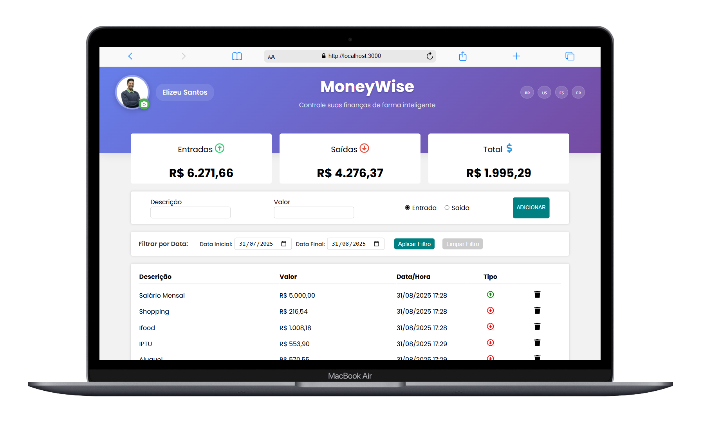

# MoneyWise

MoneyWise é um sistema de controle financeiro desenvolvido como prática de JavaScript e React. Ele permite que os usuários gerenciem suas finanças de forma inteligente, adicionando entradas e saídas, filtrando por datas e visualizando resumos financeiros.

## Tecnologias Utilizadas

- **React**: Biblioteca JavaScript para construção de interfaces de usuário.
- **Styled-Components**: Para estilização dinâmica e modular.
- **i18n**: Suporte a múltiplos idiomas (Português, Inglês, Espanhol e Francês).
- **JavaScript**: Linguagem principal para desenvolvimento do sistema.

## Funcionalidades

- Adicionar e remover transações financeiras.
- Filtrar transações por período.
- Visualizar resumo financeiro com entradas, saídas e total.
- Suporte a múltiplos idiomas.

## Imagens do Sistema

### Tela Principal


### Resumo Financeiro


## Como Executar o Projeto

1. Clone o repositório:
   ```bash
   git clone <url-do-repositorio>
   ```
2. Instale as dependências:
   ```bash
   npm install
   ```
3. Inicie o servidor de desenvolvimento:
   ```bash
   npm start
   ```
4. Acesse o sistema no navegador em: [http://localhost:3000](http://localhost:3000)

## Scripts Disponíveis

- `npm start`: Inicia o servidor de desenvolvimento.
- `npm test`: Executa os testes.
- `npm run build`: Gera a versão de produção do projeto.
